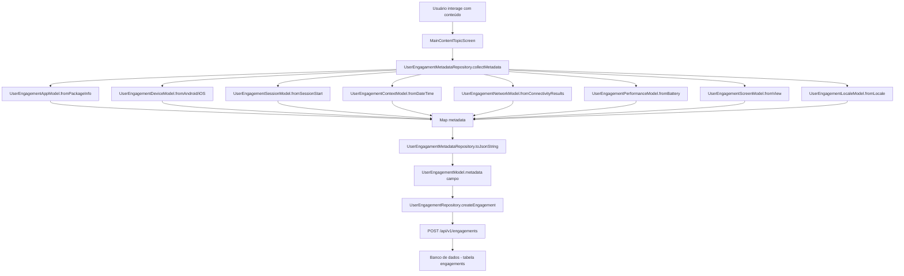

# Metadata Models - User Engagement

## 📋 Visão Geral

Este diretório contém **Value Objects** responsáveis por modelar os metadados contextuais que acompanham cada evento de engajamento do usuário. Esses modelos seguem os princípios de **Domain-Driven Design (DDD)** e são usados para enriquecer os dados de telemetria, analytics e auditoria da aplicação.

## 🎯 Por Que Tantos Models?

### Princípio: Single Responsibility (SOLID)

Ao invés de criar um único modelo gigante com todos os campos, separamos os metadados em **domínios específicos**, cada um com sua responsabilidade bem definida:

| Model | Responsabilidade | Dados Coletados |
|-------|-----------------|----------------|
| **`UserEngagementAppModel`** | Metadados da aplicação | Versão, build number, package name, app name |
| **`UserEngagementDeviceModel`** | Metadados do dispositivo | Modelo, fabricante, OS, versão do OS, se é físico |
| **`UserEngagementSessionModel`** | Metadados da sessão | Início da sessão, duração, telas navegadas |
| **`UserEngagementContextModel`** | Metadados temporais | Hora do dia, dia da semana, fuso horário, se é fim de semana |
| **`UserEngagementScreenModel`** | Metadados da tela | Resolução física/lógica, pixel ratio, aspect ratio |
| **`UserEngagementNetworkModel`** | Metadados de rede | Tipo de conexão (WiFi, 4G, 5G), qualidade da rede |
| **`UserEngagementPerformanceModel`** | Metadados de performance | Nível de bateria, estado de carga, uso de memória |
| **`UserEngagementLocaleModel`** | Metadados de idioma | Código de idioma, país, locale completo |

### Benefícios da Separação:

✅ **Manutenibilidade:** Mudanças em um domínio não afetam outros  
✅ **Testabilidade:** Cada model pode ser testado isoladamente  
✅ **Reusabilidade:** Models podem ser usados em diferentes contextos  
✅ **Clareza:** Nome da classe indica exatamente quais dados contém  
✅ **Type Safety:** Uso de tipos específicos ao invés de Map genérico  

## 🏗️ Arquitetura e Uso

### 1. Coleta de Metadados (Repository Pattern)

A classe **`UserEngagamentMetadataRepository`** é responsável por:

- **Coletar** dados de múltiplas fontes (device_info, package_info, connectivity, etc.)
- **Instanciar** os models apropriados
- **Compor** um JSON estruturado com todos os metadados
- **Cachear** informações estáticas (device, app) para otimizar performance

**Exemplo de coleta:**

```dart
// Localização: lib/features/user_engagement/user_engagament_metadata_repository.dart

// Coleta todos os metadados
final metadata = await UserEngagamentMetadataRepository.collectMetadata(
  previousScreen: 'home_screen',
  screenCount: 5,
);

// Converte para JSON string
final metadataJson = UserEngagamentMetadataRepository.toJsonString(metadata);
```

### 2. Integração com UserEngagementModel

O JSON gerado pelos metadata models é armazenado no campo **`metadata`** do modelo principal:

```dart
// Localização: lib/features/user_engagement/user_engagement_model.dart

class UserEngagementModel {
  final String? id;
  final String userId;
  final String contentId;
  final String engagementType; // CLICK_TO_VIEW, VIEW, LIKE, etc.
  
  final String? metadata; // ← JSON dos metadata models
  
  // ... outros campos
}
```

### 3. Estrutura do JSON de Metadata

O JSON final possui a seguinte estrutura hierárquica:

```json
{
  "device": {
    "model": "iPhone 15 Pro",
    "manufacturer": "Apple",
    "brand": "Apple",
    "os": "iOS",
    "osVersion": "17.2.1",
    "isPhysicalDevice": true
  },
  "app": {
    "version": "1.2.3",
    "buildNumber": "42",
    "packageName": "com.example.aguide",
    "appName": "AGuide PT-BR",
    "locale": {
      "languageCode": "pt",
      "countryCode": "BR",
      "fullLocale": "pt_BR"
    }
  },
  "network": {
    "connectionType": "wifi",
    "connectionTypes": ["wifi"],
    "isConnected": true
  },
  "session": {
    "sessionStartedAt": "2026-03-24T10:30:00.000Z",
    "sessionDurationSeconds": 127,
    "sessionDurationMinutes": 2,
    "previousScreen": "home_screen",
    "screenViewCount": 5
  },
  "context": {
    "timestamp": "2026-03-24T10:32:07.000Z",
    "hourOfDay": 10,
    "dayOfWeek": "Monday",
    "isWeekend": false,
    "isBusinessHours": true,
    "timezone": "America/Sao_Paulo",
    "timezoneOffset": -3
  },
  "screen": {
    "physicalWidth": 1179,
    "physicalHeight": 2556,
    "logicalWidth": 393,
    "logicalHeight": 852,
    "pixelRatio": 3.0,
    "resolution": "1179x2556",
    "aspectRatio": "19.5:9"
  },
  "performance": {
    "batteryLevel": 87,
    "batteryState": "charging",
    "isCharging": true,
    "isBatteryLow": false
  }
}
```

## 🔄 Fluxo de Dados



## 📦 Classes que Utilizam as Metadata Models

### 1. UserEngagamentMetadataRepository
**Localização:** `lib/features/user_engagement/user_engagament_metadata_repository.dart`

**Responsabilidades:**
- Coletar dados de múltiplas fontes (packages nativos)
- Instanciar metadata models
- Compor JSON estruturado
- Gerenciar cache de dados estáticos
- Otimizar coleta (evitar chamadas desnecessárias)

**Métodos principais:**
- `collectMetadata()`: Coleta todos os metadados
- `toJsonString()`: Converte Map para JSON string
- `clearCache()`: Limpa cache de dados estáticos
- `startSession()`: Inicia rastreamento de sessão

### 2. MainContentTopicScreen
**Localização:** `lib/features/main_contents/topic/screens/main_content_topic_screen.dart`

**Uso:**
```dart
// Ao registrar engajamento
final metadata = await UserEngagamentMetadataRepository.collectMetadata(
  previousScreen: widget.sourcePage,
  screenCount: _topicsViewed.length,
);

final metadataJson = UserEngagamentMetadataRepository.toJsonString(metadata);

final engagement = UserEngagementModel(
  userId: userId,
  contentId: topicId,
  engagementType: EngagementTypeEnum.clickToView.name,
  metadata: metadataJson, // ← JSON dos metadata models
  // ...
);

await _engagementRepository.createEngagement(engagement);
```

### 3. UserVerifiedContentWizardScreen
**Localização:** `lib/features/user_verified_content/screens/user_verified_content_wizard_screen.dart`

**Uso:** Similar ao MainContentTopicScreen, coleta metadata ao registrar engajamentos em conteúdos verificados.

### 4. UserEngagementRepository
**Localização:** `lib/features/user_engagement/user_engagement_repository.dart`

**Responsabilidades:**
- Recebe `UserEngagementModel` (contendo metadata JSON)
- Serializa para API REST
- Envia para backend via HTTP POST
- Trata erros e valida responses

## 🎓 Padrões de Design Utilizados

### 1. **Value Object (DDD)**
Todas as metadata models são **imutáveis** (`final` fields, `const` constructors).

### 2. **Factory Pattern**
Cada model possui factories específicos para diferentes fontes:
```dart
UserEngagementDeviceModel.fromAndroid(AndroidDeviceInfo info)
UserEngagementDeviceModel.fromIOS(IosDeviceInfo info)
UserEngagementDeviceModel.fromJson(Map<String, dynamic> json)
```

### 3. **Repository Pattern**
`UserEngagamentMetadataRepository` abstrai a complexidade de coletar dados de múltiplas fontes.

### 4. **Composite Pattern**
O JSON final é composto pela agregação de múltiplos metadata models.

## 📊 Persistência e Uso Backend

### Tabela do Banco de Dados

```sql
-- Tabela: engagements (backend)
CREATE TABLE engagements (
  id VARCHAR PRIMARY KEY,
  user_id VARCHAR NOT NULL,
  content_id VARCHAR NOT NULL,
  engagement_type VARCHAR NOT NULL,
  metadata JSONB, -- ← JSON dos metadata models armazenado como JSONB
  engaged_at TIMESTAMP,
  -- ... outros campos
);
```

### Queries de Analytics

O JSON de metadata permite queries avançadas no backend:

```sql
-- Exemplo: Engajamentos por tipo de dispositivo
SELECT 
  metadata->'device'->>'os' as operating_system,
  COUNT(*) as total_engagements
FROM engagements
WHERE engagement_type = 'VIEW'
GROUP BY operating_system;

-- Exemplo: Conversão por horário do dia
SELECT 
  metadata->'context'->>'hourOfDay' as hour,
  COUNT(*) as total_views,
  COUNT(DISTINCT user_id) as unique_users
FROM engagements
WHERE engagement_type = 'CLICK_TO_VIEW'
GROUP BY hour
ORDER BY hour;
```

## 🔧 Manutenção e Extensão

### Adicionar Novo Metadata Model

1. **Criar nova classe** em `metadata_models/`
2. **Implementar Value Object** (imutável, factories, toJson/fromJson)
3. **Adicionar coleta** em `UserEngagamentMetadataRepository`
4. **Atualizar testes** em `test/features/user_engagement/`

**Exemplo:**

```dart
// user_engagement_accessibility_model.dart
class UserEngagementAccessibilityModel {
  final bool isVoiceOverEnabled;
  final bool isReduceMotionEnabled;
  final double textScale;

  const UserEngagementAccessibilityModel({
    required this.isVoiceOverEnabled,
    required this.isReduceMotionEnabled,
    required this.textScale,
  });

  factory UserEngagementAccessibilityModel.fromMediaQuery(MediaQueryData data) {
    return UserEngagementAccessibilityModel(
      isVoiceOverEnabled: data.accessibleNavigation,
      isReduceMotionEnabled: data.disableAnimations,
      textScale: data.textScaleFactor,
    );
  }

  Map<String, dynamic> toJson() {
    return {
      'isVoiceOverEnabled': isVoiceOverEnabled,
      'isReduceMotionEnabled': isReduceMotionEnabled,
      'textScale': textScale,
    };
  }
}
```

## 📚 Referências

- **Documentação API:** `docs/FLUTTER_ENGAGEMENT_API_INTEGRATION_GUIDE.md`
- **Repository Interface:** `lib/features/user_engagement/user_engagement_repository_interface.dart`
- **Model Principal:** `lib/features/user_engagement/user_engagement_model.dart`
- **Exemplo de Uso:** `lib/features/main_contents/topic/screens/main_content_topic_screen.dart` (linha ~1700)

## 🚀 Benefícios da Arquitetura Atual

✅ **Separação de Responsabilidades:** Cada model cuida de um domínio específico  
✅ **Type Safety:** Sem Maps genéricos, tudo fortemente tipado  
✅ **Extensibilidade:** Fácil adicionar novos metadados sem quebrar código existente  
✅ **Performance:** Cache de informações estáticas (device, app)  
✅ **Analytics Avançados:** JSON estruturado permite queries complexas no backend  
✅ **Debugging:** Logs detalhados facilitam reprodução de bugs  
✅ **Compliance:** Auditoria completa de interações do usuário  

---

**Última atualização:** Março 2026  
**Versão do Flutter:** 3.x+  
**Padrão de Arquitetura:** MVVM + Repository Pattern + DDD